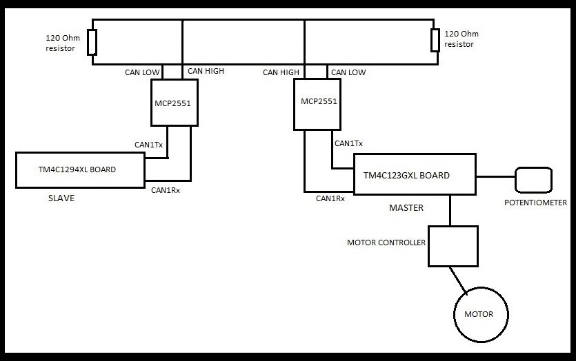
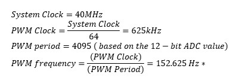
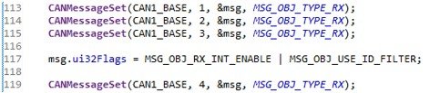

## Table of contents
* [Introduction](#introduction)
* [Technologies](#technologies)
* [Parts](#parts)
* [Description](#description)
* [Problems](#problems)
* [Improvement](#improvement)

## Introduction
The idea behind the final project was to use CAN bus, that is available in the microcontrollers, to send data over that reflects real world scenario. Cars and vehicles have an ECU in them that generates certain data which can be accessed using the OBD2 port. Information such as faulty sensors in the vehicle can be seen on a device when connected to the ECU via OBD2 port; data such as revolutions per minute of the engine and other important data can also be read over this protocol. The goal of this project was to use CAN bus to simulate some parts of this real-world scenario where information can be sent over a CAN bus. There are two microcontrollers that are involved in this project; one is a master device, and the other is a slave device. Master device has a potentiometer connected to it which is used to control the PWM signal sent out to a DC motor. Master device is also connected to a CAN transceiver that sends the value generated by the ADC module to the slave device. The slave device only has a CAN transceiver connected to it which reads in the value sent over from the master device. The reason these development boards needs the transceivers is because they do not generate differential signals necessary for CAN bus protocol.

## Technologies
* Embedded C
* C
* Code Composer Studio
* CAN Bus Protocol
* UART 

## Parts
* EK-TM4C123GXL Launchpad
*	EK-TM4C1294XL Launchpad
*	1 x 10kΩ potentiometer
*	1 x ULN 2003
*	1 x DC Motor
*	2 x MCP 2551 CAN Transceiver 
*	2 x USB cable
* Jumper wires
*	Bread Board

## Description
The master device used in the project is an EK-TM4C123GXL development board and the slave device used is an EK-TM4C1294XL development board; the first one has the TM4C123GH6PM microcontroller powering it while the latter has the TM4C1294NCPDT. The reason these boards were chosen was because the microcontroller in these boards had CAN module built into it. The project also needed two MCP2551 transceivers, one for each board. A simple motor driver, ULN2003, was also needed to drive the 6V DC motor since the maximum voltage out of the development board was 5V. The following high level block diagram followed by pictures of the circuit diagram illustrates the layout of the project.

<figure>
  
 <figcaption><b>Figure 1 : Block Diagram</b></figcaption>
</figure>
&nbsp;
<figure>
  
 <figcaption style="padding-bottom: 1px;"><b>Figure 2 : Complete Circuit</b></figcaption>
</figure>
&nbsp;
<figure>
  
 <figcaption><b>Figure 3 : Master Device EK-TM4C123GXL</b></figcaption>
</figure>
&nbsp;
<figure>
  
 <figcaption><b>Figure 4 : Slave Device EK-TM4C1294XL</b></figcaption>
</figure>
&nbsp;
<figure>
  
 <figcaption><b>Figure 5 : CAN Transceivers MCP2551</b></figcaption>
</figure>

### Master Board
  The ADC available inside TM4C123GH6PM is a 12-bit ADC. The speed of the DC motor is controlled via a 10kΩ potentiometer interfaced to the GPIO of the processor. The analog output of the potentiometer is configured as an input to the ADC; ADC converts this data into 12-bit digital data which is used to setup the PWM width. Since the ADC is 12-bit, the highest count can be till 4096, therefore the period of PWM output is set to 4096 to match that of ADC. The generated PWM signal controls the DC motor connected through the ULN2003 motor driver. 
PWM calculation done so that frequency doesn’t go overboard what the DC motor can handle. The motor didn’t come with a datasheet, so a decision was made after reading bunch of forum posts to drive it with a low frequency. 

** Unfortunately due to Covid-19, I didn't have access to the oscilloscopes in the university labs; I expect this frequency is what I would have seen on an oscilloscope if I had connected the PWM output pin to it. 

The code is setup to send the 32 bits of data over the CAN bus. Texas Instruments(TI) provides a high-level API library known as Tivaware which comes with a message struct that handles the message structure. The ADC value that needs to be sent over is a 32-bit value, but the transmitting message object data can only be 8-bits. Hence an 8-bit pointer was created inside the while(1) loop to point to the ADC value, and the message was later appended before being sent out over CAN bus.
The UART is also configured in this project only to serve the purpose of sending the data from the board to the terminal in the computer. It has nothing to do with any sort of data transfer between the boards.

### Slave Board
  The data received by the EK-TM4C1294XL is of 32-bit size. A 32-bit sized FIFO buffer was setup using a circular array which holds all the incoming message. Inside the CAN interrupt handler, another pointer was used to access this FIFO buffer and print the message over UART to the terminal. Another tricky part about setting it up with a FIFO buffer was to include the following code: 

This took care of setting up CAN message object for the way the FIFO buffer was set up. Every time there is an incoming message, each 8-bit message object gets stored in the FIFO buffer. Then it is printed out in FIFO manner as well over UART.

The UART is also configured in this slave device only to serve the purpose of sending the data from the board to the terminal in the computer. It has nothing to do with any sort of data transfer between the boards
## Problems
One of the problems I faced was to setup the receiving end of the CAN bus; initially the UART printed only garbage data. A lot of debugging and setting separate simple CAN bus projects just to send streams of data manually made me realize a FIFO buffer was necessary to get the right data. This process took me more than a couple of days to figure out. Another issue I had was to power the MCP2551 transceivers. Initially I planned to power them from individual development boards, but then I decided to power both of them from the slave device since it didn’t have a motor or anything else connected to it. The motor and the transceivers use +5V as Vdd. 
## Improvement
Some improvement that can be made to this project is by adding multiple other nodes i.e., adding other boards. Other sensor data may be sent over CAN bus as well, but I think the CAN interrupt handler will become more complex because then the interrupts needs to prioritize as to which data to receive first if multiple sensors are sending data at the same time. 
